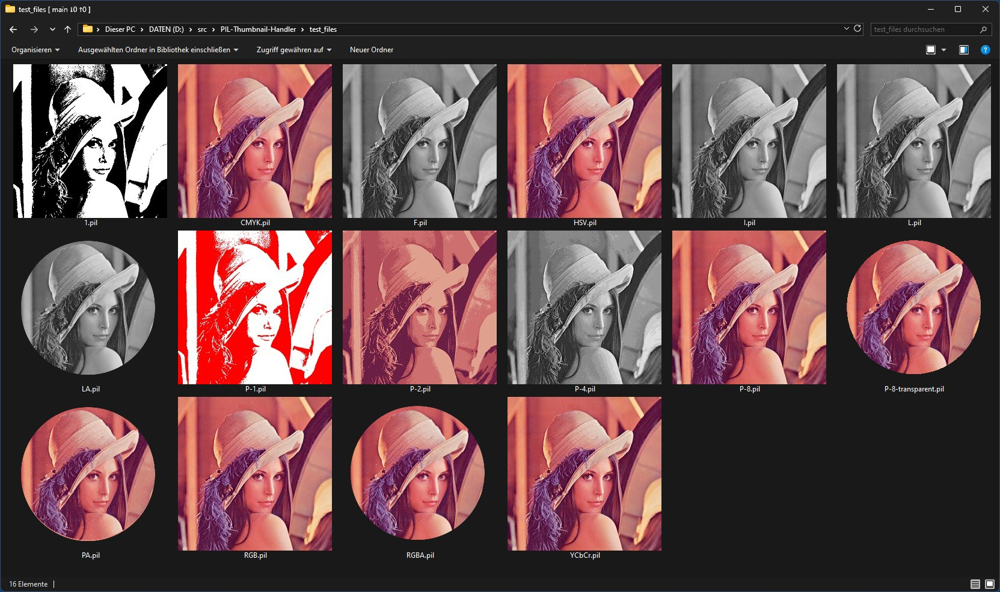

## PIL Thumbnail Handler

`PIL Thumbnail Handler` is a shell extension (.dll) for Windows 10/11 x64 that allows Explorer to show thumbnails for PIL image files (.pil). It's basically a fun project, and propably only useful for myself, since the "PIL image file format" is my own invention (see below).

The PIL image file format supports *any* image mode that [Pillow]() supports - that's the idea of the format, and the reason why it exists -, whereas the shell extension supports the following 15 modes:
- CMYK (4 bytes per pixel)
- RGBA (4 bytes per pixel)
- RGB (3 bytes per pixel)
- LA (L + alpha channel, so 2 bytes per pixel)
- PA (P + alpha channel, so 2 bytes per pixel)
- L (grayscale image, 1 byte per pixel)
- P (palette based image, 1 byte per pixel)
- P:4 (palette based image with at most 16 colors, 2 pixels stored in each byte)
- P:2 (palette based image with at most 4 colors, 4 pixels stored in each byte)
- P:1 (palette based image with 2 colors, 8 pixels stored in each byte)
- 1 (black & white image, 8 pixels stored in each byte)
- I (grayscale, 32-bit signed integer pixels, so 4 bytes per pixel)
- F (grayscale, 32-bit floating point pixels, so 4 bytes per pixel)
- HSV (3 bytes per pixel)
- YCbCr (3 bytes per pixel)

(Note: for Pillow P:1, P:2 and P:4 are actually rawmodes, not modes. The image
plugin automatically loads and saves P or PA images with those rawmodes
if the image's palette has at most 2 resp. 4 resp. 16 colors. The mode
string saved in the file is still just P resp. PA).

The PIL image file format supports DEFLATE compression of the image data, which is the same compression that PNG uses. Therefor a compressed RGB PIL file has roughly the same filesize as the same image stored as PNG.

## Usage

Run `register_run_as_admin.cmd` (in unpacked release) as admin to register the shell extension `PILThumbs.dll` in the system. If you now navigate to the `test_files` folder, Explorer should show thumbnails for all included .pil files.

Run `unregister_run_as_admin.cmd` as admin to unregister the shell extension.

## PilImagePlugin.py (Python)

`PilImagePlugin.py` is a simple image plugin for [Pillow](https://pillow.readthedocs.io/en/stable/) that allows Pillow to read and write PIL image files, with any image mode that Pillow supports.

Usage:
```python
from PIL import Image
import PilImagePlugin  # registers the plugin in Pillow

img = Image.open('CMYK.pil')
img.show()

# Save as compressed grayscale image
img.convert('L').save('L.pil', compression=1)

# Same as: img.convert('L').save('L.pil', compression=PilImagePlugin.Compression.DEFLATE)
# DEFLATE compression is now the default, so also the same as:
# img.convert('L').save('L.pil')
# Use compression=0 or compression=PilImagePlugin.Compression.UNCOMPRESSED to save as 
# uncompressed image file.
```

## Screenshots                
                              
*Windows 11 Explorer showing thumbnails for all 15 supported image modes*     


## PIL image file format

"PIL" is a very simple (dummy) image file format that stores [Pillow's](https://pillow.readthedocs.io/en/stable/)
internally used image data - as returned by Image.tobytes() -
directly in the file, optionally compressed with DEFLATE compression.

It therefor supports any image mode (not rawmode) that Pillow supports.

It adds a minimal file header to the data, and in case of mode
"P" or "PA" also the palette colors and the index of a transparent
color in the palette, if there is one.

It can optionally also store EXIF data at the very end of the file.

The purpose of this file format is not usage in real world applications,
but to simplify testing features in Pillow based applications. Since
the format can load and save any image mode, it makes testing image
operations, filters, conversions etc. concerning supported modes a
little easier. Pillow comes with an obscure file format called IM -
I guess mainly for the very same purpose - that also supports most image modes,
but not all of them.

**Note**: this PIL file format is not affiliated with the PIL/Pillow project/dev
team in any way, I called it "PIL" because a) it is based on PIL/Pillow's
image modes and internal data layout, and b) because the file extension
*.pil was still available, i.e. not used by any common file format yet.

### File structure

```
                            (4 bytes per row)

|        P        |        L        |       \0        |  <compression>  |
|      <width> (unsigned short)     |     <height> (unsigned short)     |
|       <mode> (PIL Image.mode as 4 chars, right padded with \0)        |


Only if mode is "P" or "PA":
|  <palette size> (unsigned short)  |      <tr>       |   <tr index>    |
|                 <palette data> (3 bytes per color, RGB)               |
|                                ...                                    |


|                  <image data size> (unsigned long)                    |
|               <image data> (compressed or uncompressed)               |
|                                ...                                    |

Either:
|                               0000 (=EOF)                             |
Or:
|                    <EXIF data> (starting with "Exif")                 |
|                                ...                                    |


<compression>: \0 = uncompressed, \1 = DEFLATE (other compression schemes could be added)
<tr>: Transparency? \0 = no, \1 = yes
<tr index>: Index of transparent color in palette (if <tr> is \1)
```

## Compiling

Compiling the shell extension requires MS Visual Studio 2017 or later.
